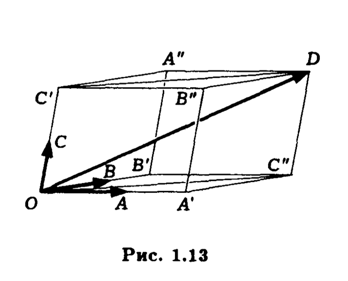
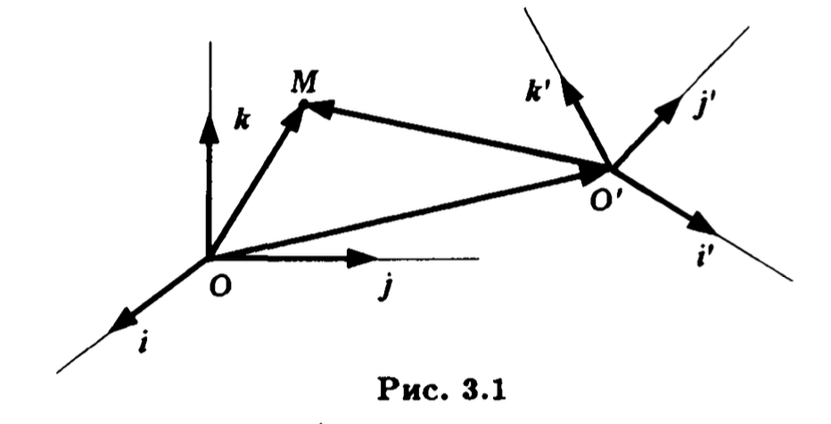
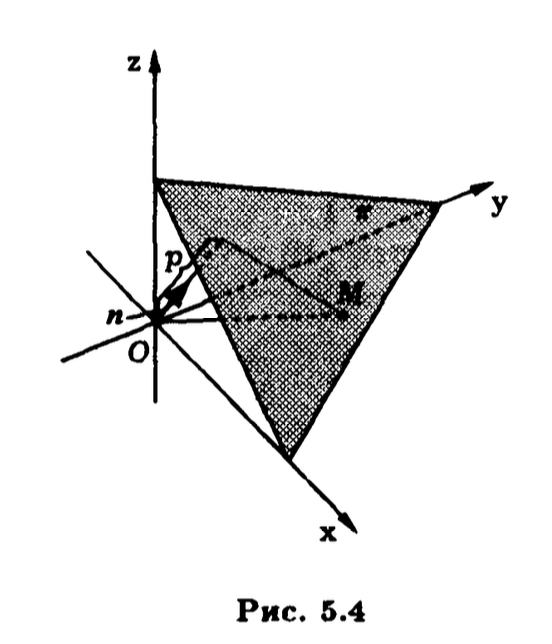

# Коллоквиум №1

## Часть 1. Векторная алгебра

### Задание 1. Сформулировать определения свободного вектора и линейных операций над векторами. Сформулировать и доказать свойства линейных операций над векторами.
**Свободный вектор** - множество векторов равных между собой по длине и направлению (начало и конец не закреплены).

**Линейные операции над векторами** - операции сложения векторов и умножения вектора на скаляр.

**Свойства линейных операций**  
1. Коммутативность $\overline{a}+\overline{b}=\overline{b}+\overline{a}$
    > Доказательство через параллелограмм
2. Ассоциативность по сложению $\overline{a}+(\overline{b}+\overline{c})=(\overline{a}+\overline{b})+\overline{c}$
    > Доказательство через четырёхугольник
3. $\exists \space \overline{0}: \overline{0}+\overline{a}=\overline{a}$
    > Очевидно
4. $\forall \space \overline{a} \space \exist \space \overline{b}: \overline{a}+\overline{b}=\overline{0}$
    > $\overline{b} = -\overline{a}$
5. $\forall \space \overline{a}, \space \overline{b} \space  \exists! \space \overline{x}: \overline{a}+\overline{x}=\overline{b}$
    >$\overline{x}=\overline{b}+(-\overline{a}) \quad \space \overline{a}+(\overline{b}+(-\overline{a}))=\overline{b} \\$
    Пусть $y$ - решение уравнения $\overline{a}+\overline{x}=\overline{b} \\ \begin{cases} \overline{a}+\overline{x}=\overline{b} \\ \overline{a}+\overline{y}=\overline{b} \end{cases} \implies \overline{a}+\overline{x} = \overline{a}+\overline{y} \implies \overline{x}=\overline{y} \implies $ единственное решение
6. Ассоциативность по умножению $(\lambda \cdot \mu) \cdot \overline{a} = \lambda \cdot ( \mu \cdot \overline{a})$
    > $\overline{c} = (\lambda \cdot \mu) \cdot \overline{a} \hspace{1em} \overline{d} = \lambda \cdot ( \mu \cdot \overline{a}) \hspace{1em} |\overline{c}|=|\overline{d}|$
    > 1) $\lambda \cdot \mu > 0 \implies \overline{c} \uparrow \uparrow \overline{a} \text{ и } \overline{d} \uparrow \uparrow \overline{a}\implies \overline{c} \uparrow \uparrow \overline{d}$
    > 2) $\lambda \cdot \mu < 0 \implies \overline{c} \uparrow \downarrow \overline{a} \text{ и } \overline{d} \uparrow \downarrow \overline{a}\implies \overline{c} \uparrow \uparrow \overline{d}$
7. Дистрибутивность относительно векторов $\lambda \cdot (\overline{a} + \overline{b}) = \lambda \cdot \overline{a} + \lambda \cdot \overline{b}$
8. Дистрибутивность относительно чисел $\overline{a} \cdot (\lambda + \mu) = \lambda  \cdot \overline{a} + \mu \cdot \overline{a} $
    > Нетрудно заметить, что в указанном равенстве - 3 коллинеарных вектора. Поэтому доказательство сводится к подсчету длин векторов, которым присвоены знаки, указывающие направление. Рассмотрим 3 случая:  
    𝜆𝜇=0: 0=0+0  
    𝜆>0 и 𝜇>0: все 3 вектора имеют одно направление, совпадающее с направлением вектора а. При сложении этих векторов справа складываются их длины, а доказываемое равенство сводится к равносильному: (𝜆+𝜇)*⏐a⏐= 𝜆⏐a⏐+𝜇⏐a⏐  
    𝜆<0 и 𝜇<0: все 3 вектора имеют одно направление, не совпадающее с направлением вектора а. Доказываемое равенство сводится к равносильному: (-𝜆-𝜇)*⏐a⏐= -𝜆⏐a⏐-𝜇⏐a⏐(𝜆+𝜇)*⏐a⏐= 𝜆⏐a⏐+𝜇⏐a⏐  
    𝜆>0 и 𝜇<0: При сложении векторов 𝜆a и 𝜇a вычитаются их длины, т.к. складываются векторы противоположного направления. Если ⏐𝜆⏐>⏐𝜇⏐, то получим вектор однонаправленный вектору а. Если ⏐𝜆⏐<⏐𝜇⏐, то получим вектор противоположно направленный вектору а. Его длина, согласно определению произведения на число, равна $|\lambda + \mu|\cdot|a|$. Учитывая  направление этого вектора, заключаем, что он равен $(\lambda + \mu)\cdot|a|$, т.е. доказываемое равенство верно и при противоположных знаках при коэффициентах.

### Задание 2. Дать определения коллинеарности и компланарности векторов. Сформулировать и доказать геометрический критерии линейной зависимости 2-х и 3-х векторов. Сформулировать и доказать теорему о линейной зависимости 4-х векторов. 
Вектора $\overline{a},\overline{b}$ **коллинеарны**, если они лежат на одной прямой или на параллельных прямых.

Вектора $\overline{a},\overline{b},\overline{c}...$ **компланарны**, если они лежат в одной плоскости или параллельны одной плоскости.

**Теорема 1.4**: &nbsp;&nbsp; $\overline{a},\overline{b} - л/з \iff$ они коллинеарны.

> $\Rightarrow \hspace{1em} \lambda \overline{a} + \mu \overline{b} = \overline{0} \space \implies \space \overline{b} = -{\lambda \over \mu} \overline{a} \space \implies$ коллинеарны  
$  \Leftarrow  \hspace{1em}  \overline{a} \parallel \overline{b} \space \implies \space \overline{b}=\lambda \overline{a} \space \implies \space \lambda \overline{a} + (-1)\overline{b}=\overline{0} \space \implies \space $ л/з

**Теорема 1.5**: &nbsp;&nbsp; $\overline{a},\overline{b},\overline{c} - л/з \iff$ они компланарны.

> $\Rightarrow \hspace{1em} \lambda \overline{a} + \mu \overline{b} + \gamma \overline{c} = \overline{0} \space \implies \space \overline{c} = -{\lambda \over \gamma}\overline{a} - {\mu \over \gamma} \overline{b} \space \implies$ компланарны по определению суммы векторов  
$ \Leftarrow \hspace{1em} $ Если какие-либо 2 из этих трёх векторов коллинеарны или один из векторов равен $0$, то всё верно. Если никакие два не коллинеарны, то отложим векторы $\overline{a},\overline{b},\overline{c}$ от одной точки $O$. Их концами будут точки $A$, $B$ и $C$ соответственно. $A'$ - точка пересечения прямой $OA$ c прямой параллельной $OB$. Аналогично точку $B'$. Получаем $\overline{OA'} = \alpha\overline{OA}; \space \overline{OB'} = \beta\overline{OB} \implies \overline{OС}=\alpha\overline{OA} + \beta\overline{OB} \implies$ л/з

**Теорема 1.6**: &nbsp;&nbsp; $\forall \space \overline{a},\overline{b},\overline{c},\overline{d} \implies$ они л/з.

> Если какие-либо 2 коллинеарны или какие-либо 3 компланарны или 1 является нулевым, то система л/з. Если ни одно условие не выполняется: Концами векторов $a$, $b$, $c$, $d$ будут некоторые точки $А$, $В$, $С$, $D$. 
  
Через точку $О$ проведем три плоскости, параллельные плоскостям $ОВС$, $ОСА$, $ОАВ$, и пусть $A'$, $В'$, $С'$ — точки пересечения зтих плоскостей с прямыми $OA$, $ОВ$, $ОС$ соответственно. Мы получаем параллелепипед $ОА'С''В'С'B''DА''$, и векторы $а$, $b$, $с$ лежат на ребрах параллелепипеда, выходящих из вершины $O$. Так как четырехугольник $OC”DC'$ является параллелограммом, то $\overline{OD} = \overline{OC''} + \overline{OC'}$. В свою очередь, отрезок $ОС"$ является диагональю параллелограмма $ОА'С''В'$, так что $\overline{OC''} = \overline{OA'} + \overline{OB'}$. Значит, $\overline{OD} = \overline{OA'} + \overline{OB'} + \overline{OC'} \implies \overline{OD} = \alpha\overline{OA} + \beta\overline{OB} + \gamma\overline{OC} \implies \space$ л/з. 

### Задание 3. Дать определения базиса, разложение вектора по базису, координат вектора. Сформулировать и доказать утверждение о линейных операциях в координатах. 
**Базис** - это
1) Базис в $V_1 - \forall \overline{a}$ ≠ $0$
2) Базис в $V_2$ - это любая пара л/н векторов
3) Базис в $V_3$ - это любая тройка л/н векторов

**Разложение по базису** - $\overline{x} = \lambda_1 \overline{e}_1 + \lambda_2 \overline{e}_2. \quad \lambda_1$ и $\lambda_2$ - **координаты вектора**.

**Теорема 1.7** При сложении двух векторов их координаты в одном и том же базисе складываются. При умножении вектора на число координаты этого вектора умножаются на это число.

> Фиксируем в $V_3$ базис $е_1, е_2, e_3$. Возьмем два произвольных вектора $x$ и $у$ и запишем их разложения в выбранном базисе: $$ x = x_1e_1 + x_2е_2 + x_3e_3 \\ у = y_1e_1 + у_2е_2 + у_3e_3 $$ Используя свойства линейных операций, вычисляем сумму этих векторов: $$ х + у = (x_1e_1 + x_2е_2 + x_3e_3) + (y_1e_1 + у_2е_2 + у_3e_3) = \\ (x_1 + y_1)е_1 + (x_2 + у_2)е_2 + (x_3 + y_3)e_3. $$ Мы получили разложение суммы векторов в фиксированном базисе. Отсюда заключаем, что координаты $х_i$ и $у_i$ исходных слагаемых, соответствующие одному вектору $е_i$ в базисе $(i = 1,2,3)$, складываются. Аналогично с учетом свойств линейных операций имеем $$ \lambda х = \lambda(x_1e_1 + x_2е_2 + x_3e_3) = (\lambda х_1)е_1 + (\lambda x_2)e_2 + (\lambda x_3)e_3 $$ В итоге получаем разложение вектора $\lambda х$ в фиксированном базисе. Из этого разложения видим, что каждая из координат исходного вектора $х$ умножена на число $\lambda$.

### Задание 4. Дать определение декартовой системы координат на плоскости и в пространстве. Какая система координат называется прямоугольной? Записать формулу для вычисления расстояния между двумя точками в прямоугольной системе координат и формулу деления отрезка в заданном отношении. Вывести эти формулы. 

**Декартова система координат** - это пара $(O, e)$, где $O$ - некоторая точка пространства - начало координат, $e$ - базис в $V_3$

**Прямоугольная система координат** - это ортонормированный базис $e=\{i, j, k\}$

**Расстояние между двумя точками**(длина отрезка): $A(x_1; y_1; z_1) \space B(x_2; y_2; z_2) \space \overline{AB}=|\overline{AB}|=\sqrt{(x_2 - x_1)^2+(y_2 - y_1)^2+(z_2 - z_1)^2}$

**Деление отрезка в заданном отношении**: $A(x_1; y_1; z_1) \space B(x_2; y_2; z_2)$ Найти такую точку $C \in \overline{AB}$, что ${\overline{AC} \over \overline{BC}}={p \over q}$, $p,q \in \R; \space p,q > 0$; $\overline{r}_c = \overline{r}_a + \overline{AC} = \overline{r}_a + {p \over p+q} \overline{AB} = \overline{r}_a + {p \over p+q}(\overline{r}_b - \overline{r}_a) = {q \over p+q}\overline{r}_a + {p \over p+q}\overline{r}_b$
$$
\begin{cases}
x_c = {qx_1 + px_2 \over p+q} \\
y_c = {qy_1 + py_2 \over p+q} \\
z_c = {qz_1 + pz_2 \over p+q}
\end{cases}
$$

### Задание 5. Что называется матрицей перехода от базиса к базису? Записать формулы замены координат вектора и точки. Вывести эти формулы.
**Преобразование координат вектора при переходе к новому базису**: $e=\{\overline{i}; \overline{j}; \overline{k}\}$ - старый базис $e' =\{\overline{i'}; \overline{j'}; \overline{k'}\}$ - новый базис.  

$$
\overline{OM} = \overline{OO'} + \overline{O'M} = b_1i + b_2j + b_3k + x'i' + y'j' + z'k' = \\
= b_1i + b_2j + b_3k + \\
+ x'(a_{11}i + a_{21}j + a_{31}k) + \\
+ y'(a_{12}i + a_{22}j + a_{32}k) + \\
+ z'(a_{13}i + a_{23}j + a_{33}k) = \\
= (a_{11}x' + a_{12}y' + a_{13}z' + b_1)i + \\
+ (a_{21}x' + a_{22}y' + a_{23}z' + b_1)j + \\
+ (a_{31}x' + a_{32}y' + a_{33}z' + b_1)k
$$

$$
\begin{cases}
x = a_{11}x' + a_{12}y' + a_{13}z' + b_1 \\
y = a_{21}x' + a_{22}y' + a_{23}z' + b_2 \\
z = a_{31}x' + a_{32}y' + a_{33}z' + b_3
\end{cases}
$$

### Задание 6. Дать определение скалярного произведения векторов. Сформулировать и доказать его основные свойства.
**Скалярным произведением векторов** $\overline{a}$ и $\overline{b}$ $\in V_3$ называется число $\overline{a} \cdot \overline{b} = |\overline{a}| \cdot |\overline{b}| \cdot \cos{\phi}$, где $\phi$ угол между $\overline{a}$ и $\overline{b}$.

Геометрические свойства
1. $\overline{a} \cdot \overline{b} = 0 \iff \overline{a} \perp \overline{b}$
2. $\overline{a} \cdot \overline{b} < 0 \iff \angle \phi$ - острый; $\overline{a} \cdot \overline{b} > 0 \iff \angle \phi$ - тупой;

Алегебраические свойства
1. Коммутативность 
2. Дистрибутивность $\forall \overline{a}, \overline{b}, \overline{c} \in V_3$ $(\overline{a}+\overline{b}) \cdot \overline{c} = \overline{a} \cdot \overline{c} + \overline{b} \cdot \overline{c}$  
    > ff
3) Ассоциаливность $\forall \overline{a}, \overline{b} \in V_3$  $\forall \lambda$ $(\lambda\overline{a}) \cdot \overline{b} = \lambda(\overline{a} \cdot \overline{b})$  
    > $(\lambda\overline{a}) \cdot \overline{b} = пр_{\overline{b}}(\lambda\overline{a}) \cdot |\overline{b}| = \lambda пр_{\overline{b}}(\overline{a}) \cdot \overline{b}  = \lambda(\overline{a} \cdot \overline{b})$
4. $\overline{a} \cdot \overline{a} = |\overline{a}^2| \geq 0$

### Задание 7. Записать формулу вычисления скалярного произведения в координатах и вывести эту формулу. Сформулировать и доказать следствие из этой формулы для ортонормированного базиса. Вывести формулу длины вектора, его направляющих косинусов в ортонормированном базисе, угла между двумя векторами.
**Скалярное произведение в координатах в ортонормированном базисе**: Пусть векторы $a$ и $b$ из $V_3$ заданы своими координатами в ортонормарованном базисе $i, j, k$: $a=\{x_a; y_a; z_a\}$, $a=\{x_b; y_b; z_b\}$ Это означает, что имеются разложения: 
$$
a = x_ai + y_aj + z_ak \quad b = x_bi + y_bj + z_bk \\
\overline{a} \cdot \overline{b} = (x_ai + y_aj + z_ak)(x_bi + y_bj + z_bk) = \\
= x_ax_bii + x_ay_bij + x_az_bik + \\
+ y_ax_bji + y_ay_bjj + y_az_bjk + \\
+ z_ax_bki + z_ay_bkj + z_az_bkk = \\
= x_ax_bi^2 + y_ay_bj^2 + z_az_bk^2 = x_ax_b + y_ay_b + z_az_b
$$

**Длина вектора**: $|\overline{a}|=\sqrt{\overline{a} \cdot \overline{a}} = \sqrt{x^2+y^2+z^2}$

**Угол между векторами**: $\cos{\phi} = {\overline{a} \cdot \overline{b} \over |\overline{a}| \cdot |\overline{b}|} = {x_1x_2 + y_1y_2 + z_1+z_2 \over \sqrt{x_1^2+y_1^2+z_1^2} \cdot \sqrt{x_2^2+y_2^2+z_2^2}}$

**Направляющие косинусов в ортонормированном базисе**:  
$ \cos{\alpha} = {x \over \sqrt{x^2+y^2+z^2}} \cos{\beta} = {y \over \sqrt{x^2+y^2+z^2}} \cos{\gamma} = {z \over \sqrt{x^2+y^2+z^2}}$

### Задание 8. Дать определение проекции вектора. Сформулировать и доказать утверждение о геометрическом смысле координат в ортонормированном базисе.
**Ортогональной проекцией вектора** $\overline{AB}$ на ось $l$ называется разность проекций конца вектора и его начала на ось.

Пусть на плоскости заданы прямая $L$ и точка $А$. Опустим из точки $А$ на прямую $L$ перпендикуляр. Тогда его основание (точку $О$) называют **ортогональной проекцией** точки $А$ на прямую $L$.

**Координаты вектора в ортонормированном базисе** - это его проекции на направления соответствующих координат векторов (осей).
$$
\overline{a} = xi + yj + zk \\
x = \overline{a} \cdot \overline{i} = пр_{\overline{i}}\overline{a} \quad
y = пр_{\overline{j}}\overline{a} \quad
z = пр_{\overline{k}}\overline{a} \\
$$

### Задание 9. Что такое ориентации плоскости? Привести примеры выбора ориентации плоскости. Дать определение ориентированной площади параллелограмма. Сформулировать и доказать основные ее свойства.
**Ориентация плоскости** - выбор в $V_2$ положительно ориентированного базиса.

### Задание 10. Что такое ориентация пространства? Привести примеры выбора ориентации пространства (правые и левые тройки векторов). Дать определение ориентированного объема параллелепипеда. Сформулировать и доказать основные его свойства.
**Ориентация пространства** - выбор в $V_3$ положительно ориентированного базиса.

**Тройка $a$, $b$, $c$ некомпланарных векторов** называется **правой**, если направление вектора $a$ совмещается с направлением вектора $b$ при помощи кратчайшего поворота вектора $a$ в плоскости этих векторов, который со стороны вектора $c$ совершается против хода часовой стрелки.

**Объёмом ориентированного параллелепипеда**,построенного на векторах $\overline{a},\overline{b},\overline{c}$ называется число:
$$
V(\overline{a},\overline{b},\overline{c}) = 
\begin{cases}
+V, \text{если } \overline{a},\overline{b},\overline{c} - \text{левая тройка } \\
-V, \text{если } \overline{a},\overline{b},\overline{c} - \text{правая тройка } \\
0, \text{если } \overline{a},\overline{b},\overline{c} - \text{компланарны } \\
\end{cases}
$$

**Свойства ориентированного объёма**:
- Кососимметричность $\forall \overline{a},\overline{b},\overline{c} \in V_3 \space$ $V(\overline{a},\overline{b},\overline{c})=-V(\overline{b},\overline{a},\overline{c})=-V(\overline{c},\overline{b},\overline{a}=-V(\overline{a},\overline{c},\overline{b})=-V(\overline{b},\overline{a},\overline{c})=-V(\overline{c},\overline{a},\overline{b})$ 
- Линейность $\forall \overline{a},\overline{b},\overline{c} \in V_3 \space \forall \lambda, \mu \in \R \space$ $V(\overline{a}, \lambda\overline{b}_1+\mu \overline{b}_2, \overline{c})=\lambda V(\overline{a}, \overline{b}_1, \overline{c}) + \mu V(\overline{a}, \overline{b}_2, \overline{c})$

### Задание 11. Дать определение векторного произведения векторов. Сформулировать и доказать основные его свойства
**Векторным произведением векторов** $а$ и $b$ называют такой вектор $с$, который удовлетворяет следующим трем условиям:
1. Вектор $c$ ортогонален векторам $а$ и $b$ 
2. Длина вектора $c$ равна $|c|=|a|\cdot|b|\sin{\phi}$, где $\phi$ угол между $а$ и $b$
3. Упорядоченная тройка векторов $а$, $b$, $c$ является правой

**Свойства векторного произведения:**
- Геометрические свойства
    1. $\overline{a} \parallel \overline{b} \iff \overline{a} \times \overline{b} = 0$
    > $\Rightarrow \hspace{1em} a \parallel b \implies \sin{\phi}=0 \implies a \times b = 0 \\ \Leftarrow \hspace{1em} a \times b = 0 \implies \sin{\phi}=0 \implies a \parallel b$
    2. Если $\overline{a} \nparallel \overline{b}$, то $|\overline{a} \times \overline{b}| = S$, где $S$ - площадь параллелограмма, построенного на этих векторах как на смежных сторонах.
    3. Пусть $\pi$ — плоскость, перпендикулярная вектору $b$. Тогда $\overline{a} \times \overline{b} = (пр_{\pi}a) \times b$.
    > $a' = пр_{\pi}a \hspace{1em} |a' \times b| = |a'| |b| \sin(90°) = |a'| |b| = |a| \cos(90-\phi) |b| = |a| |b| \sin(\phi) = |a \times b|$
- Алгебраические свойства
    1. Антикоммутативность: $\forall \overline{a},\overline{b} \in V_3 \quad a \times b = -(b \times a)$ 
    >Модули векторов $a \times b$ и $b \times a$ равны, а также они оба ортогональны векторам $a$ и $b$. Однако по построению они противоположно направленные. Значит, они противоположны
    2. Ассоциативность: $(\lambda\overline{a}) \times \overline{b} = \lambda(\overline{a} \times \overline{b})$  
    3. Дистрибутивность: $(\overline{a}+\overline{b}) \times \overline{c} = \overline{a} \times \overline{c} + \overline{b} \times \overline{c}$

### Задание 12. Дать определение смешанного произведения векторов. Сформулировать и обосновать утверждение о его связи с ориентированным объемом.
**Смешанное произведение** трёх векторов $\overline{a},\overline{b},\overline{c}$ называется число $(a \times b) \cdot c \space$ равное скалярному произведению векторного произведения первых двух векторов
и третьего вектора.

**Теорема.** Смешанное произведение трех некомпланарных векторов $abc$ равно объему параллелепипеда, построенного на этих векторах как на ребрах, выходящих из одной вершины, взятого со знаком плюс, если тройка векторов $а, b, с$ - правая, и со знаком минус, если эта тройка - левая.

> Вектор $a \times b$ перпендикулярен грани указанного параллелепипеда, построенной на векторах $a$ и $b$, и имеет длину, равную площади $S$ зтой грани. Обозначив через $е$ единичный вектор, ортогональный векторам $а$ и $b$ и однонаправленный с векторным произведением $a \times b$, получим $$ a \times b = Se $$ Смешанное произведение $(a, b, c)$ равно скалярному произведению вектора $Se$ на вектор $c$ и равно $S|с|\cos{\phi}$, где $\phi$ — угол между векторами $a \times b$ и с. Отметим, что число $|с|\cos{\phi}$ равно проекции вектора $с$ на направление вектора $е$, а его модуль, т.е. $||с|\cos{\phi}|$, равен высоте $h$ параллелепипеда. Знак проекции определяется углом $\phi$ между $с$ и $е$. Если $\phi$ < 90°, то векторы $с$ и $е$ находятся по одну сторону от плоскости векторов $а$ и $b$. Значит, тройки векторов $а$, $b$, $e$ и $a$, $b$, $с$ имеют одну и ту же ориентацию — правую. В этом случае смешанное произведение положительно и равно объему параллелепипеда со знаком плюс. Если же $\phi$ > 90°, то ориентация указанных троек различная, т.е. тройка $a$, $b$, $с$ является левой, и смешанное произведение будет равно объему параллелепипеда, со знаком минус. 

## Часть 2. Аналитическая геометрия

### Задание 13
$Ax + By + C = 0$ - уравнение первого порядка $A^2 + B^2$ ≠ $0$

Любую прямую в плоскости можно задать уравнением первого порядка.

> $\Rightarrow \hspace{1em}$ $l$ - прямая на плоскости. $M \in l; \space \overline{M_0M} \perp \overline{n} \implies \overline{M_0M} \cdot \overline{n} = 0 \implies A(x - x_0)+B(y - y_0) = 0 \implies Ax + By + (-ax_0 - by_0) = 0 \implies Ax + By + C = 0$   
$\Leftarrow \hspace{1em} l:Ax + By + C = 0; \space M_0(x_0, y_0) \in l; \space \forall M \in l \implies \begin{cases} ax + by + C = 0 \\ ax_0+by_0 + C = 0 \end{cases} \implies a(x - x_0)+b(y - y_0) = 0 \implies \overline{M_0M} \perp \overline{n}$

**Нормаль** - перпендикуляр. Если прямая задана $Ax + By + C = 0$, то вектор $\overline{n}=(A; B)$ - нормаль.  
**Нормальный вектор прямой** - любой ненулевой вектор, лежащий на любой прямой перпендикулярной данной.

### Задание 14
**Параметрическое уравнение прямой**:
$L$ - прямая; $M_0(x_0, y_0)$; $\overline{s} = \{l; m\}$ $\overline{s}$ - направляющий вектор; $\overline{M_0M}=t\overline{s}$; $\overline{M_0M}=(x-x_0; y-y_0) \implies$ 
$$
\implies
\begin{cases} x - x_0 = lt \\ y - y_0 = mt \end{cases}
\implies 
\begin{cases} x = x_0 + lt \\ y = y_0 + mt
\end{cases}
$$; 

**Каноническое уравнение прямой**:
$M_0(x_0, y_0)$ - начальная точка, $\overline{s} = \{l; m\}$ - направляющий вектор. Из параметрического уравнения прямой выразим $t$: $$t = {x - x_0 \over l} = {y - y_0 \over m}$$

**Направляющий вектор** - это любой вектор лежащий на данной прямой или на параллельной.

### Задание 15
**Уравнение прямой с угловым коэффициентом**:
$\tg{\phi} = {y - y_0 \over x - x_0} = k \implies y = kx + (y_0 - kx_0)$

**Уравнение прямой, проходящей через две точки**:
Зададим прямую $L$ на плоскости двумя различными точками $М_1(x_1, у_1)$ и $М_2(x_2,у_2)$ на ней.
Тогда вектор $\overline{М_1 М_2} \parallel L$ и ее каноническое уравнение как уравнение прямой,проходящей через точку $М_1(x_1, у_1)$, с направляющим вектором $s = \overline{М_1 М_2}$, имеет вид
$$
{x - x_1 \over x_2 - x_1} = {y - y_1 \over y_2 - y_1}
$$

**Уравнение прямой в отрезках**: Определим прямую $L$ ее точками $А(а,0)$ и $В(0,b)$ пересечения с осями координат, предполагая, что эти две точки не совпадают с началом системы координат, т.е. что а≠0 и b≠0. Записывая уравнение прямой $L$ по двум ее точкам $А$ и $В$, получаем 
$$
{x - a \over 0 - a} = {y - 0 \over b - 0} \implies
-{x \over a} + 1 = {y \over b} \implies
{x \over a} + {y \over b} = 1
$$

**Нормальное уравнение прямой**: Определим прямую $L$ при помощи перпендикулярного ей единичного вектора $n$ и расстояния $р>0$ до прямой от начала системы координат. Существуют два единичных вектора, перпендикулярных прямой $L$. Из зтих двух выберем тот, который имеет начало в точке $О$ и направлен "в сторону прямой" $L. \hspace{0.33em} n = \{\cos{\phi}; \sin{\phi}\}$ Условие, что точка $М(х; у)$ принадлежит прямой $L$, эквивалентно тому, что ортогональная проекция радиус-вектора точки $М$ на направление нормального вектора прямой равна расстоянию $р$ от точки $О$ до прямой: $np_n\overline{OM}=p$ Проекция $np_n\overline{OM}$, совпадает со скалярным произведением векоров $\overline{OM}$ и $n$, так как длина нормального вектора $n$ равна единице, и это приводит к равенству $\overline{OM}n = p$. Записав скалярное произведение $\overline{OM}n$ в координатах, получим уравненне прямой $L$, в виде
$$
x\cos{\phi} + y\sin{\phi} - p = 0
$$

### Задание 16
**Способы исследования взаимного расположения двух прямых на плоскости**:
1. Условие параллельности: $L_1 \parallel L_2 \iff \overline{n_1} \parallel \overline{n_2} \iff {A_1 \over A_2}={B_1 \over B_2}$
2. Совпадение прямых: $L_1 = L_2 \implies {A_1 \over A_2}={B_1 \over B_2}={C_1 \over C_2}$
3. Угол между прямыми: $\cos{\phi} = |\cos{\phi}| = {\overline{n_1} \cdot \overline{n_2} \over |\overline{n_1}| \cdot |\overline{n_2}|} = {A_1A_2 + B_1B_2 \over \sqrt{A_1^2 + B_1^2} \cdot \sqrt{A_2^2 + B_2^2}}$

**Расстояние от точки до прямой**: $M_0(x_0; y_0); \space M(x; y) \in L; \space \overline{n} \perp L$. $\rho(M_0; L)=|пр_{\overline{n}}\overline{M_0M}|={|\overline{M_0M} \cdot \overline{n}| \over |\overline{n}|} = {|A(x - x_0)+B(y - y_0)| \over \sqrt{A^2 + B^2}} = {|Ax_0+By_0+C| \over \sqrt{A^2 + B^2}}$

**Угол между прямыми**: $\angle(L_1, L_2) = \angle(\tau_1, \tau_2) = \arccos{\tau_1 \cdot \tau_2 \over |\overline{\tau_1}| \cdot |\overline{\tau_2}|}$

### Задание 17
**Пучок прямых на плоскости** - семейство всех прямых, проходящих через фиксированную точку на плоскости.

**Утверждение об уравнении пучка прямых**: для того чтобы прямая входила в пучок прямых, определяемый парой непараллельных прямых
$$
L_1: a_1x+b_1y+c_1 = 0, \quad L_2: а_2х + b_2у + с_2 = 0
$$
необходимо и достаточно, чтобы ее общее уравнение можно было записать в виде
$$
\alpha(a_1x+b_1y+c_1) + \beta(а_2х + b_2у + с_2) = 0,
\quad \alpha^2 + \beta^2 ≠ 0
$$

> $\Rightarrow \hspace{1em} L \in \Phi; \space L: \space Ax+By+C= 0; \space \overline{n}(A, B); \space \overline{n}_1(A_1, B_1);\space \overline{n}_2(A_2, B_2) \\ \overline{n}_1 \nparallel \overline{n}_2$ (иначе было бы $L_1 = L_2$) $\implies \overline{n}_1$ и $\overline{n}_2$ - базис в $V_2 \implies \\ \overline{n}=\alpha\overline{n}_1 + \beta\overline{n}_2 \implies A=\alpha A_1 + \beta A_2; \space B=\alpha B_1 + \beta B_2; \space M_0(x_0; y_0)$ - базисная точка пучка $\Phi$. $\space C = -Ax_0 - By_0 = -(\alpha A_1 + \beta A_2)x_0 - (\alpha B_1 + \beta B_2)y_0 = \alpha(-A_1x_0-B_1y_0) + \beta(-A_2x_0-B_2y_0)=\alpha C_1 + \beta C_2 \implies (\alpha A_1 + \beta A_2)x + (\alpha B_1 + \beta B_2)y + (\alpha C_1 + \beta C_2)z = 0$  
$\Leftarrow \hspace{1em} L: \alpha(a_1x+b_1y+c_1) + \beta(а_2х + b_2у + с_2) = 0,\space M_0(x_0; y_0)$ - базисная точка пучка $\Phi \implies a_1x_0+b_1y_0+c_1 = 0$ и $a_2x_0+b_2y_0+c_2 = 0 \implies \alpha(a_1x_0+b_1y_0+c_1) + \beta(а_2х_0 + b_2у_0 + с_2) = 0 \implies M_0 \in L \implies L \in \Phi$

### Задание 18
Любая плоскость в пространстве является
поверхностью первого порядка и любая поверхность первого порядка в пространстве есть плоскость.

>Пусть $\pi$ - плоскость; $М_0 \in \pi$; $n \perp \pi$. Тогда множество всех точек в пространстве разбивается на три подмножества. Первое состоит из точек,принадлежащих плоскости, а два других — из точек, расположенных по одну и по другую стороны плоскости. Какому из этих множеств принадлежит произвольная точка $М$ пространства, зависит от знака скалярного произведения $n\overline{M_0M}$. Если $М \in \pi$, то $n \perp \overline{M_0M} \implies n\overline{M_0M}=0$. Обозначим координаты точек $М_0(x_0; у_0; z_0)$, $М(x; у; z)$ и вектора $n(A; B; C)$. Так как $\overline{M_0M} = \{x — x_0; y — y_0; z — z_0\}$, то, записывая скалярное произведение в координатной форме векторов $n$ и $\overline{M_0M}$, получаем условие принадлежности точки $М$ рассматриваемой плоскости в виде $$ A(x — x_0) + B(y — y_0) + C(z — z_0) = 0 \\ Ax + By + Cz + D = 0$$

### Задание 19
**Параметрическое уравнение плоскости**: Фиксированной плоскости $\pi$ в пространстве соответствует множество параллельных ей векторов, т.е. пространство $V_2$.  Выберем в этом пространстве базис $е_1\{e_{1x};e_{1y};e_{1z}\}$, $е_2\{e_{2x};e_{2y};e_{2z}\}$, ($е_1 \nparallel e_2$; $е_1, е_2 \parallel \pi$), и точку $М_0\{x_0; y_0; z_0\} \in \pi$. Если точка $М\{x;y;z\} \in \pi$, то это эквивалентно тому, что $\overline{M_0M} \parallel \pi$, т.е. $\overline{M_0M} \in V_2$. Это означает, что существует разложение вектора $\overline{M_0M}$ в базисе $е_1$, $е_2$, т.е. существуют такие числа, $t_1$ и $t_2$, для которых $\overline{M_0M} = t_1e_1 + t_2e_2$.  
$$
\begin{cases}
x = x_0 + t_1e_{1x} + t_2e_{2x} \\
y = y_0 + t_1e_{1y} + t_2e_{2y} \\
z = z_0 + t_1e_{1z} + t_2e_{2z}
\end{cases}
$$

**Уравнение плоскости, проходящей через три заданные точки**: Пусть $M_1, M_2, M_3 \in \pi \implies \overline{M_1M_2}, \overline{M_1M_3}, \overline{M_1M} - компланарны \implies [\overline{M_1M_2},\overline{M_1M_3}, \overline{M_1M}] = 0 \implies$
$$ 
\begin{bmatrix}
x-x_1 & y-y_1 & z-z_1 \cr
x_2-x_1 & y_2-y_1 & z_2-z_1 \cr
x_3-x_1 & y_3-y_1 & z_3-z_1 \cr
\end{bmatrix}
= 0
$$

### Задание 20
Рассмотрим частный случай плоскости, проходящей через 3 точки $M_1(a,0,0)$, $M_2(0,b,0)$, $M_3(0,0,c)$ причём $a,b,c$ ≠ $0$. Эти точки, не лежат на одной прямой, а значит задают плоскость, которая отсекает на осях координат отрезки ненулевой длины ($\overline{OM_1}=a, \overline{OM_2}=b, \overline{OM_3}=c$):  Пусть $M(x,y,z)$ - произвольная точка, принадлежащая плоскости. Найдём векторы $\overline{M_1M_2}, \overline{M_1M_3}, \overline{M_1M_2}$: $\overline{M_1M_2}=\{-a, b, 0\}, \overline{M_1M_3}=\{-a;0;c\}, \overline{M_1M_2}=\{x-a;y;z\}$.

$$ 
\begin{bmatrix}
x-a & y & z \cr
-a & b & 0 \cr
-a & 0 & c \cr
\end{bmatrix}
= 0
$$
Получим уравнение
$$
bc(x-a)+acy+abz=0
$$
Разделим полученное уравнение на abc
$$
{x \over a} + {y \over b} + {z \over c} = 1
$$

**Нормальное уравнение плоскости**. Рассмотрим некоторую плоскость $\pi$ в пространстве. Фиксируем для нее единичный нормальный вектор $n$, направленный из начала координат "в сторону плоскости", и обозначим через $p$ расстояние от начала $О$ системы координат до плоскости $\pi$ (рис. 5.4). Если плоскость проходит через начало системы координат, то $p = 0$, а в качестве направления для нормального вектора $n$ можно выбрать любое из двух возможных.

Если точка $M$ принадлежит плоскости $\pi$, то это эквивалентно тому, что ортогональная проекция вектора $ОМ$ на направление вектора $n$ равна $p$, т.е. выполнено условие $nОМ = пр_nОМ = р$, так как длина вектора $n$ равна единице. Обозначим координаты точки $М$ через $(х; у; z)$ и пусть $n=\{ \cos{\alpha}; \cos{\beta}; \cos{\gamma} \}$. Записывая скалярное произведение в равенстве $nОМ = p$ в координатной форме, получаем
$$
x\cos{\alpha} + y\cos{\beta} + z\cos{\gamma} - p = 0
$$

### Задание 21
$$\alpha: A_1x+B_1y+C_1z+D_1=0 \hspace{1em} \beta: A_2x+B_2y+C_2z+D_2=0$$
1. $\alpha \parallel \beta \iff \overline{n}_1 \parallel \overline{n}_2 \iff {A_1 \over A_2} = {B_1 \over B_2} = {C_1 \over C_2}$
2. $\alpha = \beta \iff {A_1 \over A_2} = {B_1 \over B_2} = {C_1 \over C_2} = {D_1 \over D_2}$
3. $\alpha \perp \beta \iff \overline{n}_1 \perp \overline{n}_2 \implies A_1A_2+B_1B_2+C_1C_2=0 $

**Угол между плоскостями**:  
$\phi = \angle(\alpha; \beta) = \angle(\overline{n}_1; \overline{n}_2)$  
$\cos{\phi} = {|\overline{n}_1 \cdot \overline{n}_2| \over |\overline{n}_1| \cdot |\overline{n}_2|} = {|A_1A_2 + B_1B_2 + C_1C_2| \over \sqrt{A_1^2 + B_1^2 + C_1^2} \cdot \sqrt{A_2^2 + B_2^2 + C_2^2}}$

**Расстояние от точки до плоскости**:  
$\pi; \space M_0; \space n \perp \pi; \space M_1$ - начало $n \space (M_1 \in \pi) \implies$
$$
\rho(M_0; \pi) = |пр_{n}\overline{M_1M_0}| = |n\overline{M_1M_0}|
$$ 
Если $\pi: Ax+By+Cz+D=0$, то 
$$ n = {\{A; B; C\} \over \sqrt{A^2+B^2+C^2}} $$
Пусть $M_0(x_0;y_0;z_0)$; $M_1(x_1;y_1;z_1)$, тогда
$$ Ax_1+By_1+Cz_1+D=0 $$
Имеем 
$$
\rho(M_0; \pi) = {|A(x_0 - x_1)+B(y_0 - y_1)+C(z_0 - z_1)| \over \sqrt{A^2+B^2+C^2}} = \\
= {|Ax_0 + By_0 + Cz_0 - (Ax_1+By_1+Cz_1)| \over \sqrt{A^2+B^2+C^2}} = {|Ax_0 + By_0 + Cz_0 + D| \over \sqrt{A^2+B^2+C^2}}
$$

### Задание 22
**Пучком плоскостей** в пространстве называют семейство всех плоскостей, содержащих фиксированную прямую. Пучок однозначно определяется любой парой своих различных плоскостей. Любые две непараллельные плоскости однозначно определяют некоторый пучок плоскостей.

Для того чтобы плоскость принадлежала пучку плоскостей, определяемому парой непараллельных плоскостей
$$
\pi_1: A_1x + B_1y + C_1z + D_1 = 0, \\ 
\pi_2: A_2x + B_2y + C_2z + D_2 = 0,
$$
необходимо и достаточно, чтобы ее общее уравнение можно было записать в виде
$$
\alpha(A_1x + B_1y + C_1z + D_1) + \beta(A_2x + B_2y + C_2z + D_2) = 0,
$$
где $\alpha^2+\beta^2$ ≠ 0

> $\Rightarrow \hspace{1em}$ Пусть плоскость $\pi \in $ "пучку". $\hspace{0.4em} n_1 \nparallel n_2 \implies n = \alpha n_1 + \beta n_2 \implies ... \implies \\ \implies \pi_3: (\alpha A_1 + \beta A_2)x+(\alpha B_1 + \beta B_2)y+(\alpha C_1 + \beta C_2)z+(\alpha D_1 + \beta D_2)= 0$
> $\Leftarrow \hspace{1em}$ Как для пучка прямых

### Задание 23
**Связкой плоскостей** называют семейство всех плоскостей в пространстве с одной общей точкой. Связка плоскостей однозначно определяется любой тройкой своих плоскостей, не принадлежащих одному пучку плоскостей.

**Для того чтобы плоскость входила в связку плоскостей**, определяемую тройкой плоскостей $\pi_i: A_ix + B_iy + + C_iz + D_i = 0, \space i = 1,2,3,$ общего положения, необходимо и достаточно, чтобы ее общее уравнение можно было записать в виде

$$
\alpha(A_1x + B_1y+C_1z+D_1) + \beta(A_2x + B_2y+ C_2z + D_2) +\\
+ \gamma (A_3x + B_3y + C_3z + D_3) = 0,
$$
где $\alpha^2 + \beta^2 + \gamma^2$ ≠ $0$.

Доказательство аналогично доказательству теоремы 5.2. Различие состоит лишь в том, что в случае пучка плоскостей нормальные векторы двух непараллельных плоскостей образуют базис в $V_2$, а нормальные векторы трех плоскостей общего положения образуют базис в $V_3$.

### Задание 24
**Параметрическое уравнение прямой в пространстве**  
$\overline{s}(l;m;n), \hspace{0.6em} M_0(x_0;y_0;z_0) \in L, \hspace{0.6em} \forall M(x;y;z) \\
M \in L \implies \overline{M_0M} || \overline{s} \implies \overline{M_0M} = \overline{s}t \implies
\begin{cases} 
x = x_0 + lt \\ 
y = y_0 + mt \\
z = z_0 + nt 
\end{cases}$

**Каноническое уравнение прямой в пространстве.**
$$
{(x - x_0) \over l} = {(y - y_0) \over m} = {(z - z_0) \over n}
$$

### Задание 25
**Взаимное расположение двух прямых в пространстве**:
$$L_1: {x - x_1 \over l_1} = {y - y_1 \over m_1} = {z - z_1 \over n_1} L_2: {x - x_2 \over l_2} = {y - y_2 \over m_2} = {z - z_2 \over n_2}$$
$$
{l_1 \over l_2}={m_1 \over m_2}={n_1 \over n_2} \hspace{0.5em} (1) \hspace{1em} {x_2 - x_1 \over l_1} = {y_2 - y_1 \over m_1} = {z_2 - z_1 \over n_1}\hspace{0.5em} (2) \hspace{0.5em}
\begin{bmatrix}
x_2-x_1 & y_2-y_1 & z_2-z_1 \cr
l_1 & m_1 & n_1 \cr
l_2 & m_2 & n_2 \cr
\end{bmatrix}
=0 \hspace{0.5em}(3)
$$

1. $L_1 = L_2 \iff$ выполнено 1 и 2
2. $L_1 \parallel L_2 \iff$ выполнено 1 и нарушено 2
3. $L_1 \cap L_2 \iff$ выполнено 3 и нарушено 1
4. $L_1$ и $L_2$ скрещиваются $\iff$  нарушено 3

**Взаимное расположение прямой и плоскости в пространстве**:
1. $L \in \pi \iff \begin{cases} Ax_0 + By_0 + Cz_0 + D = 0 \\ Al + Bm + Cn = 0 \end{cases}$
2. $L \parallel \pi \iff \begin{cases} Ax_0 + By_0 + Cz_0 + D ≠ 0 \\ Al + Bm + Cn = 0 \end{cases}$
3. $L \cap \pi \iff Al + Bm + Cn$ ≠ $0$

**Расстояние от точки $M_0$ до прямой $L$:**  
$$ 
M_0 \in \pi; \hspace{0.5em} \overline{\tau} = (A,B,C) \implies \pi: A(x-x_0)+B(y-y_0)+C(z-z_0)=0 \\
|\overline{M_0M_1}| = \rho(L, M_0);\\
\rho(L, M_0) = {|\overline{M_0M_1} \times \overline{\tau}| \over |\overline{\tau}|} \hspace{0.5em} \Big({S \over основание} = высота\Big)
$$  

**Расстояние между параллельными прямыми**: расстояние от любой точки одной прямой до другой прямой.

**Расстояние между скрещивающимися прямыми**: 
$$
\rho(L_1, L_2) = {|s_1 s_2 \overline{M_1M_2}| \over |s_1 \times s_2|} \hspace{0.5em} \Big({V \over S_{осн.}} = высота\Big)
$$

**Угол между прямыми:**(скалярное произведение)
$$
\cos{\phi} = {|s_1s_2| \over |s_1||s_2|} = {|l_1l_2+m_1m_2+n_1n_2| \over \sqrt{l_1^2+m_1^2+n_1^2} \sqrt{l_2^2+m_2^2+n_2^2}}
$$

**Угол между прямой и плоскостью:**  
$\angle\phi = \angle(s,n) \implies$
$$
\sin{\phi}=|\cos{\phi}|={|Al+Bm+Cn| \over \sqrt{A^2+B^2+C^2} \sqrt{l^2+m^2+n^2}}
$$

### Задание 26
**Эллипс** - множество всех точек на плоскости, для которых сумма расстояний до двух фиксированных точек $F_1$ и $F_2$ есть заданная постоянная величина.

$$
|F_1M| + |F_2M| = 2a \\
\sqrt{(x-c)^2+y^2} + \sqrt{(x+c)^2+y^2} = 2a \\
(x-c)^2 + y^2 = 4a^2 + 2a\sqrt{(x+c)^2+y^2} + (x+c)^2+y^2 \\
\sqrt{(x+c)^2+y^2} = a + \epsilon x, \text{ где } \epsilon = c/a \\
(x+c)^2 + y^2 = a^2 + 2ax\epsilon + \epsilon^2x^2 \\
(a^2-c^2) {x^2 \over a^2} + y^2 = a^2 - c^2 \\
{x^2 \over a^2} + {y^2 \over b^2} = 1
$$

### Задание 27
Геометрическое место точек плоскости, для которых разность расстояний до двух фиксированных точек есть величина постоянная, называют **гиперболой**.

$$
||F_1M|-|F_2M|| = 2a \\
|\sqrt{(x-c)^2 + y^2} - \sqrt{(x+c)^2 + y^2}| = 2a \\
\sqrt{(x-c)^2 + y^2} - \sqrt{(x+c)^2 + y^2} = \pm 2a \\
-\epsilon x - a = \pm\sqrt{(x+c)^2 + y^2} \\
\sqrt{(x+c)^2 + y^2} = |\epsilon x + a| \\
(\epsilon^2-1)x^2 - y^2 = c^2 - a^2, \text{ где } \epsilon = c/a \\
{x^2 \over a^2} - {y^2 \over b^2} = 1, \text{ где } b^2 = c^2 - a^2
$$

### Задание 28
Геометрическое место точек, равно удаленных от фиксированной точки и от фиксированной прямой, называют **параболой**.  
$p$ - расстояние от фокуса до директрисы, тогда $F(p/2; 0)$

$$
\sqrt{\Big(x-{p \over 2}\Big)^2 + y^2} = |x + {p \over 2}| \\
y^2 = 2px
$$

### Задание 29
**Директориальные свойства эллипса:** Отношение фокального радиуса к расстоянию до директрисы есть величина постоянная, равная $\epsilon$.  
$ \sqrt{(x+c)^2+y^2} = a + \epsilon x, \text{ где }\epsilon = c/a \implies \begin{cases} |F_1M| = a - \epsilon x \\ |F_2M| = a + \epsilon x \end{cases}
\implies {|F_1M| \over a/\epsilon - x} = \epsilon$

**Директориальные свойства гиперболы:** Отношение фокального радиуса к расстоянию до директрисы есть величина постоянная, равная $\epsilon$.  
$\sqrt{(x+c)^2 + y^2} = |\epsilon x + a| \implies |F_2M| = \sqrt{(x+c)^2 + y^2} = \pm (\epsilon x + a); |F_1M| = \sqrt{(x-c)^2 + y^2} = \pm (\epsilon x - a) \implies {|F_2M| \over |a/\epsilon + x|}; {|F_1M| \over |a/\epsilon - x|}$ 

### Задание 30
**Уравнения касательной к эллипсу:**
$$
y'(x) = -xb^2 / ya^2\\
y - y_0 = y'(x_0)(x - x_0) \\
y - y_0 = -{x_0b^2 \over y_0a^2}(x - x_0) \\
{xx_0 \over a^2} + {yy_0 \over b^2} = {x_0^2 \over a^2} + {y_0^2 \over b^2} \\
{xx_0 \over a^2} + {yy_0 \over b^2} = 1
$$

**Уравнения касательной к гиперболе:**
$$
y'(x) = xb^2 / ya^2\\
y - y_0 = y'(x_0)(x - x_0) \\
y - y_0 = {x_0b^2 \over y_0a^2}(x - x_0) \\
{xx_0 \over a^2} - {yy_0 \over b^2} = {x_0^2 \over a^2} + {y_0^2 \over b^2} \\
{xx_0 \over a^2} - {yy_0 \over b^2} = 1
$$

**Уравнения касательной к параболе:**
$$
x'(y) = y/p\\
x - x_0 = x'(y_0)(y - y_0) \\
x - x_0 = y_0/p(y - y_0) \\
px - px_0 = yy_0 - y_0^2 \\
px - yy_0 + px_0^2 = 0 \hspace{1em} (y_0^2 = 2px_0 \text{ т.к. } M(x_0;y_0) \in параболе)
$$

### Задание 31
**Оптические свойства эллипса:**  
$n= \{ {x_0 \over a^2}; {y_0 \over b^2} \} \hspace{0.5em} n_1 = |\overline{F_1M}|\overline{F_1M} \hspace{0.5em} n_2 = |\overline{F_2M}|\overline{F_2M} \implies n_1 \parallel \overline{F_1M}; \hspace{0.5em} n_2 \parallel \overline{F_2M} \implies n_1 + n_2 $ - диагональ построенного на них ромба (биссектриса) 
$$
|\overline{F_1M}|\overline{F_1M} + |\overline{F_2M}|\overline{F_2M} = \\
= (a + \epsilon x_0) \{ x_0 - c; y_0 \} + (a - \epsilon x_0) \{ x_0 + c; y_0 \} = \\
= \{ (a + \epsilon x_0)(x_0 - c) + (a - \epsilon x_0)(x_0 + c);  2ay_0 \} = \\
= \{ 2ax_0 - 2c\epsilon x_0; 2ay_0 \} = 2a \{ (1 - {c^2 \over a^2})x_0; y_0 \} = \\ 
= 2a \{ {b^2 \over a^2}x_0; y_0 \} = 2ab^2 \{ {x_0 \over a^2}; {y_0 \over b^2} \}
$$

**Оптические свойства гиперболы:**  
$s= \{ {y_0 \over b^2}; {x_0 \over a^2} \} \hspace{0.5em} n_1 = |\overline{F_1M}|\overline{F_1M} \hspace{0.5em} n_2 = |\overline{F_2M}|\overline{F_2M} \implies n_1 \parallel \overline{F_1M}; \hspace{0.5em} n_2 \parallel \overline{F_2M} \implies n_1 + n_2 $ - диагональ построенного на них ромба (биссектриса) 
$$
|\overline{F_1M}|\overline{F_1M} + |\overline{F_2M}|\overline{F_2M} = \\
= (\epsilon x_0 + a) \{ x_0 - c; y_0 \} + (\epsilon x_0 - a) \{ x_0 + c; y_0 \} = \\
= \{ (\epsilon x_0 + a)(x_0 - c) + (\epsilon x_0 - a)(x_0 + c);  2\epsilon x_0y_0 \} = \\
= \{ 2\epsilon x_0^2 - 2ca; 2\epsilon x_0y_0 \} = 2\epsilon \{ x_0^2 - a^2; x_0y_0 \} = \\ 
= 2\epsilon \{ {y_0a^2 \over b^2}; x_0y_0 \} = 2\epsilon y_0a^2 \{ {y_0 \over b^2}; {x_0 \over a^2} \}
$$

**Оптические свойства параболы**:  
$n = \{ p; -y_0 \}; \hspace{0.5em} MF + |MF|i$ - биссектриса между лучами; $\hspace{0.5em}i$ - орт задающий направление оси $Ox$
$$
MF + |MF|i = \{ (p/2) - x_0; -y_0 \} + \{ x_0 + p/2 \}\{ 1; 0 \} = \{ p; -y_0 \} \implies\\
\implies n \parallel (MF + |MF|i)
$$

### Задание 32
Поверхность $\Omega$ называют **поверхностью вращения**, если она образована окружностями с центрами на некоторой прямой $L$ (оси вращения), которые расположены в плоскостях, перпендикулярных $L$.

$$ \phi(\pm\sqrt{x^2+y^2},z)=0 $$

**Цилиндрическая поверхность** - поверхность, получающейся при движении прямой в пространстве, которая остается параллельной своему исходному положению

$$ {x^2 \over a^2} + {y^2 \over b^2} - {z^2 \over c^2} = 0$$

**Прямой круговой конус** - поверхность, получающейся при вращении прямой $L$, пересекающейся с осью вращения.

$$ {x^2 \over a^2} + {y^2 \over b^2} - {z^2 \over c^2} = 0$$

### Задание 33
Каноническое уравнение эллипсоида: ${x^2 \over a^2} + {y^2 \over b^2} + {z^2 \over c^2} = 1$

Канонические уравнение однополостного гиперболоида: ${x^2 \over a^2} + {y^2 \over b^2} - {z^2 \over c^2} = 1$

Канонические уравнение двуполостного гиперболоида: ${x^2 \over a^2} + {y^2 \over b^2} - {z^2 \over c^2} = -1$

Каноническое уравнение эллиптического параболоида:
${x^2 \over a^2} + {y^2 \over b^2} = 2z$

Каноническое уравнение гиперболического параболоида:
${x^2 \over a^2} - {y^2 \over b^2} = 2z$

### Задание 34
### Задание 35
### Задание 36
### Задание 37
### Задание 38